# Capítulo 3

## 1. Modelos


### Explicacion

El subsistema `kiwi-mvc` utiliza modelos Mongoose para definir las colecciones principales almacenadas en MongoDB. Estos modelos forman la capa Modelo del patron MVC.

Cada clase del diagrama representa una coleccion funcional del sistema:

- `User`: usuarios autenticados.
- `Session`: sesiones de trabajo.
- `Documentation`: documentacion funcional introducida por el usuario.
- `UseCase`: casos de uso.
- `FunctionalRequirement`: requisitos funcionales.
- `GherkinScenario`: escenarios Gherkin.
- `Draft`: borradores de casos de prueba.

Este diagrama se mantiene sin propiedades ni relaciones porque su objetivo es ofrecer una vision general de los modelos principales.

## 2. Vistas 

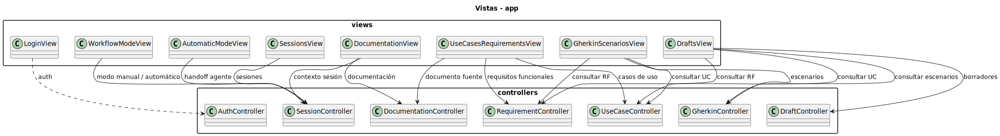

### Explicacion

`kiwi-mvc` está implementado como una Single Page Application. El servidor Express sirve `public/index.html`, y la logica de interfaz se encuentra en `public/js/app.js`.

Las vistas representan secciones funcionales de la aplicacion, no páginas renderizadas individualmente por el servidor. Cada vista consume la API REST de `kiwi-mvc` y se comunica con los controladores correspondientes.

La autenticacion se realiza mediante `LoginView`, conectada con `AuthController`. Después, el usuario trabaja con sesiones, documentacion, casos de uso, requisitos, escenarios y borradores.

El modo automático se activa desde `AutomaticModeView`, que utiliza `SessionController` para hacer el handoff hacia `Agent_ApiKiwi`.

## 3. Controladores

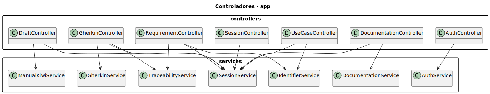

### Explicacion

Los controladores reciben las peticiones HTTP definidas en `src/routes/index.js`, validan la informacion recibida, interactuan con modelos o servicios y devuelven respuestas JSON al frontend.

Los principales controladores son:

- `AuthController`: gestiona registro, login, logout y usuario actual.
- `SessionController`: gestiona sesiones de trabajo, resultados y conexion con el agente.
- `DocumentationController`: gestiona documentacion funcional.
- `UseCaseController`: gestiona casos de uso.
- `RequirementController`: gestiona requisitos funcionales.
- `GherkinController`: gestiona escenarios Gherkin.
- `DraftController`: gestiona borradores, feedback, rechazo y publicacion.

La autenticacion interna de `kiwi-mvc` se integra dentro de `AuthController`. Las contraseñas se almacenan con hash mediante `bcryptjs`, y las sesiones HTTP se guardan en MongoDB mediante `connect-mongo`, en la coleccion técnica `httpSessions`.

### Servicios auxiliares

Aunque la aplicacion sigue un patron MVC, parte de la logica de negocio se desacopla de los controladores mediante servicios auxiliares ubicados en `src/services`. Estos servicios encapsulan operaciones reutilizables, reglas de negocio transversales, generacion de identificadores, trazabilidad y comunicacion con sistemas externos.

Los principales servicios del subsistema `kiwi-mvc` son:

- `AuthService`: centraliza operaciones auxiliares de autenticacion y sesion.
- `SessionService`: concentra la logica asociada al ciclo de vida de las sesiones de trabajo y al ensamblado de resultados.
- `DocumentationService`: da soporte al tratamiento de documentacion funcional y su asociacion a sesiones.
- `GherkinService`: encapsula operaciones auxiliares relacionadas con escenarios Gherkin.
- `IdentifierService`: genera identificadores logicos como `ucId` y `rfId`, usados para trazabilidad funcional.
- `TraceabilityService`: construye y mantiene relaciones de trazabilidad entre documentacion, casos de uso, requisitos y escenarios.
- `ManualKiwiService`: integra `kiwi-mvc` con `Kiwi TCMS` mediante XML-RPC para publicar casos de prueba.

La presencia de esta capa intermedia mejora la mantenibilidad del sistema porque evita sobrecargar los controladores con logica extensa y permite reutilizar comportamiento en varios flujos. Ademas, hace explicita la separacion entre acceso HTTP, logica de aplicacion, persistencia MongoDB e integraciones externas.

### Rutas principales de la API

La entrada HTTP del subsistema `kiwi-mvc` se centraliza en `src/routes/index.js`. Este modulo define las rutas REST consumidas por la SPA y las asocia con el controlador correspondiente, aplicando cuando procede el middleware de autenticacion `auth.js`.

La organizacion por rutas permite desacoplar la navegacion del frontend de la implementacion interna de cada controlador. Las rutas reales identificadas en el proyecto son las siguientes:

| Metodo | Ruta | Controlador principal | Proposito |
| --- | --- | --- | --- |
| `POST` | `/api/auth/login` | `AuthController` | Iniciar sesion en la aplicacion. |
| `POST` | `/api/auth/logout` | `AuthController` | Cerrar la sesion activa. |
| `POST` | `/api/auth/register` | `AuthController` | Registrar un nuevo usuario. |
| `GET` | `/api/auth/me` | `AuthController` | Recuperar el usuario autenticado. |
| `GET` | `/api/documentation/projects` | `DocumentationController` | Listar proyectos con documentacion registrada. |
| `GET` | `/api/documentation/session/:id` | `DocumentationController` | Recuperar o extraer documentacion asociada a una sesion. |
| `GET` | `/api/documentation/:documentationId/extract-requirements` | `RequirementController` | Extraer requisitos funcionales desde un documento. |
| `GET` | `/api/documentation/:documentationId/extract-use-cases` | `UseCaseController` | Extraer casos de uso desde un documento. |
| `GET` | `/api/documentation` | `DocumentationController` | Listar documentos funcionales. |
| `POST` | `/api/documentation` | `DocumentationController` | Crear un documento funcional. |
| `GET` | `/api/documentation/:id` | `DocumentationController` | Consultar un documento funcional concreto. |
| `PUT` | `/api/documentation/:id` | `DocumentationController` | Actualizar un documento funcional. |
| `DELETE` | `/api/documentation/:id` | `DocumentationController` | Eliminar un documento funcional. |
| `GET` | `/api/requirements` | `RequirementController` | Listar requisitos funcionales. |
| `POST` | `/api/requirements` | `RequirementController` | Crear un requisito funcional. |
| `GET` | `/api/requirements/:id` | `RequirementController` | Consultar un requisito funcional concreto. |
| `PUT` | `/api/requirements/:id` | `RequirementController` | Actualizar un requisito funcional. |
| `DELETE` | `/api/requirements/:id` | `RequirementController` | Eliminar un requisito funcional. |
| `GET` | `/api/use-cases` | `UseCaseController` | Listar casos de uso. |
| `POST` | `/api/use-cases` | `UseCaseController` | Crear un caso de uso. |
| `GET` | `/api/use-cases/:id` | `UseCaseController` | Consultar un caso de uso concreto. |
| `PUT` | `/api/use-cases/:id` | `UseCaseController` | Actualizar un caso de uso. |
| `DELETE` | `/api/use-cases/:id` | `UseCaseController` | Eliminar un caso de uso. |
| `GET` | `/api/scenarios` | `GherkinController` | Listar escenarios Gherkin. |
| `POST` | `/api/scenarios` | `GherkinController` | Crear un escenario Gherkin. |
| `GET` | `/api/scenarios/:id` | `GherkinController` | Consultar un escenario Gherkin concreto. |
| `PUT` | `/api/scenarios/:id` | `GherkinController` | Actualizar un escenario Gherkin. |
| `DELETE` | `/api/scenarios/:id` | `GherkinController` | Eliminar un escenario Gherkin. |
| `GET` | `/api/drafts` | `DraftController` | Listar borradores. |
| `POST` | `/api/drafts/assemble` | `DraftController` | Ensamblar un borrador a partir de artefactos funcionales. |
| `GET` | `/api/drafts/:id` | `DraftController` | Consultar un borrador concreto. |
| `PUT` | `/api/drafts/:id` | `DraftController` | Actualizar un borrador. |
| `POST` | `/api/drafts/:id/feedback` | `DraftController` | Anadir feedback a un borrador. |
| `PUT` | `/api/drafts/:id/feedback/:feedbackId` | `DraftController` | Marcar una entrada de feedback como resuelta. |
| `POST` | `/api/drafts/:id/reject` | `DraftController` | Rechazar un borrador. |
| `POST` | `/api/drafts/:id/publish` | `DraftController` | Publicar un borrador en `Kiwi TCMS`. |
| `GET` | `/api/sessions` | `SessionController` | Listar sesiones de trabajo. |
| `POST` | `/api/sessions` | `SessionController` | Crear una nueva sesion de trabajo. |
| `GET` | `/api/sessions/:id` | `SessionController` | Consultar una sesion concreta. |
| `PUT` | `/api/sessions/:id` | `SessionController` | Actualizar una sesion. |
| `DELETE` | `/api/sessions/:id` | `SessionController` | Eliminar una sesion. |
| `POST` | `/api/sessions/:id/results` | `SessionController` | Guardar resultados intermedios o finales de una sesion. |
| `POST` | `/api/sessions/:id/handoff-to-agent` | `SessionController` | Transferir una sesion manual al subsistema automatico `Agent_ApiKiwi`. |
| `POST` | `/api/kiwi-mvc/handoff` | `Agent_ApiKiwi` | Preparar o lanzar el handoff desde el subsistema automatico. |
| `GET` | `/healthz` | `Agent_ApiKiwi` | Comprobar el estado basico del servicio automatico. |

Estas rutas muestran como la capa Controlador no se limita a exponer operaciones CRUD simples, sino que implementa flujos de negocio completos como la extraccion automatica desde documentacion, el ensamblado de borradores, la publicacion en un sistema externo o el traspaso de una sesion al subsistema automatico.
## 4. Casos de uso 

### CU-01 Introducir documentacion funcional

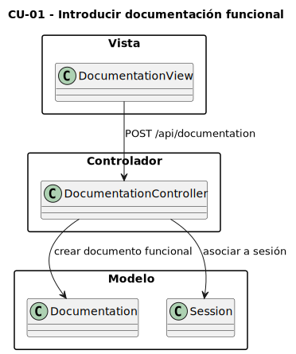

| Elemento | Valor |
| --- | --- |
| Ruta que satisface el caso | `POST /api/documentation` |
| Controlador | `DocumentationController.create` |
| Modelo principal | `Documentation` |
| Coleccion | `documentations` |

#### Explicacion

Este caso de uso se satisface específicamente con la ruta `POST /api/documentation`. La vista envía la documentacion funcional, y el controlador crea un documento en MongoDB asociado a una sesion de trabajo mediante `sessionId`.

### CU-02 Crear caso de uso

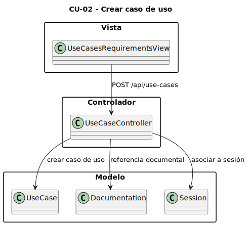

| Elemento | Valor |
| --- | --- |
| Ruta que satisface el caso | `POST /api/use-cases` |
| Controlador | `UseCaseController.create` |
| Modelo principal | `UseCase` |
| Coleccion | `usecases` |

#### Explicacion

Este caso de uso se satisface con `POST /api/use-cases`. El sistema crea un caso de uso asociado a una sesion y, si procede, a la documentacion funcional de origen mediante `documentationId`.

### CU-03 Crear requisito funcional

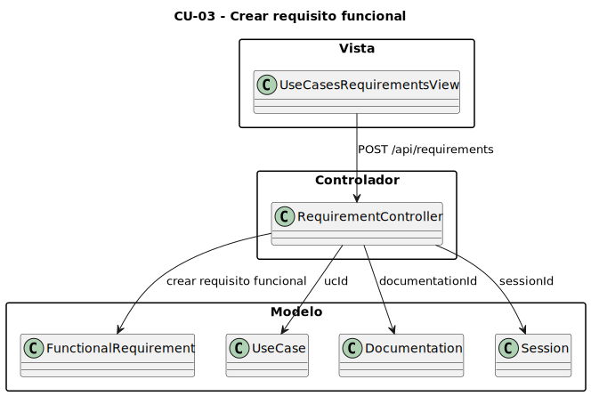

| Elemento | Valor |
| --- | --- |
| Ruta que satisface el caso | `POST /api/requirements` |
| Controlador | `RequirementController.create` |
| Modelo principal | `FunctionalRequirement` |
| Coleccion | `functionalrequirements` |

#### Explicacion

Este caso se satisface con `POST /api/requirements`. El requisito funcional queda guardado en MongoDB y puede mantener trazabilidad con el documento original mediante `documentationId` y con un caso de uso mediante `ucId`.

### CU-04 Crear escenario Gherkin

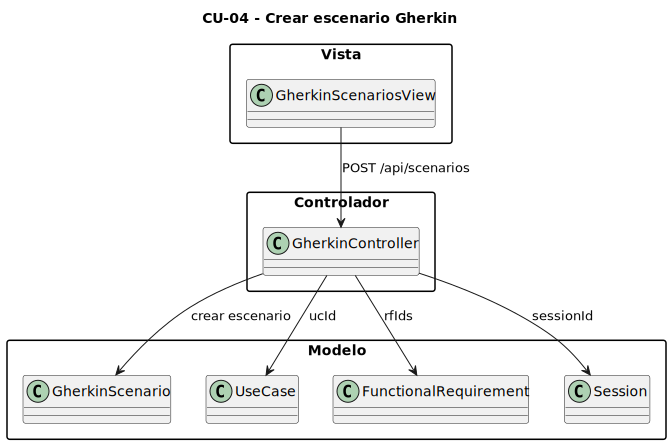

| Elemento | Valor |
| --- | --- |
| Ruta que satisface el caso | `POST /api/scenarios` |
| Controlador | `GherkinController.create` |
| Modelo principal | `GherkinScenario` |
| Coleccion | `gherkinscenarios` |

#### Explicacion

Este caso se satisface con `POST /api/scenarios`. El escenario queda almacenado en MongoDB con su estructura Gherkin y mantiene trazabilidad con casos de uso y requisitos funcionales mediante `ucId` y `rfIds`.

### CU-05 Crear borrador

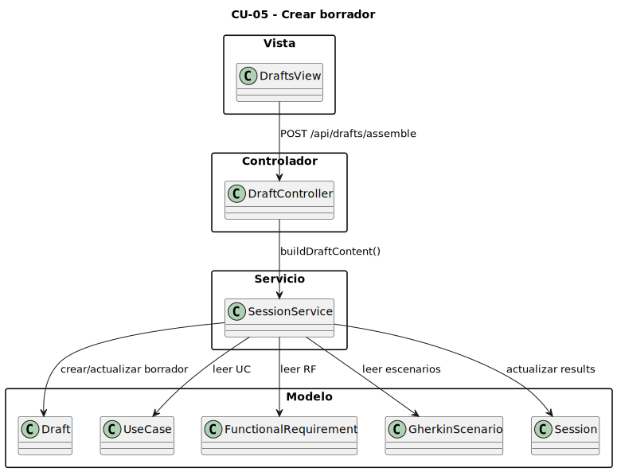

| Elemento | Valor |
| --- | --- |
| Ruta que satisface el caso | `POST /api/drafts/assemble` |
| Controlador | `DraftController.assemble` |
| Servicio principal | `SessionService.buildDraftContent` |
| Modelo principal | `Draft` |
| Coleccion | `drafts` |

#### Explicacion

Este caso se satisface con `POST /api/drafts/assemble`. El controlador ensambla un borrador a partir de los casos de uso, requisitos funcionales y escenarios Gherkin existentes en la sesion.

### CU-06 Aceptar y publicar caso de prueba a partir de borrador

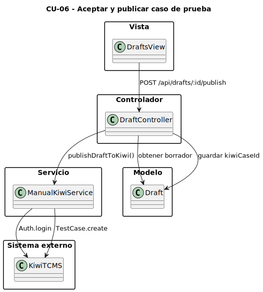

| Elemento | Valor |
| --- | --- |
| Ruta que satisface el caso | `POST /api/drafts/:id/publish` |
| Controlador | `DraftController.publish` |
| Servicio principal | `ManualKiwiService.publishDraftToKiwi` |
| Modelo principal | `Draft` |
| Sistema externo | `Kiwi TCMS` |

#### Explicacion

Este caso de uso se satisface con `POST /api/drafts/:id/publish`. El controlador recupera el borrador, llama al servicio de publicacion y este se autentica en Kiwi TCMS mediante XML-RPC para crear el caso de prueba con `TestCase.create`.

## 5. MongoDB: colecciones reales como JSON/BSON

### `users`

```json
{
  "_id": "ObjectId",
  "username": "String",
  "password": "String",
  "email": "String",
  "role": "admin | tester | analyst",
  "createdAt": "Date"
}
```

### `sessions`

```json
{
  "_id": "ObjectId",
  "createdBy": "ObjectId -> users._id",
  "name": "String",
  "description": "String",
  "projectName": "String",
  "workflowMode": "pendiente | manual | automatico",
  "status": "activa | completada",
  "currentStep": "Number",
  "agentAppUrl": "String",
  "agentSessionId": "String",
  "agentUserId": "String",
  "agentAppName": "String",
  "agentHandoffUrl": "String",
  "agentLastSyncAt": "Date",
  "results": {
    "savedAt": "Date",
    "documents": [],
    "useCases": [],
    "requirements": [],
    "scenarios": [],
    "draft": {}
  },
  "createdAt": "Date",
  "updatedAt": "Date"
}
```

### `documentations`

```json
{
  "_id": "ObjectId",
  "sessionId": "ObjectId -> sessions._id",
  "uploadedBy": "ObjectId -> users._id",
  "projectName": "String",
  "documentType": "DRF | DDS",
  "label": "String",
  "title": "String",
  "content": "String",
  "createdAt": "Date",
  "updatedAt": "Date"
}
```

### `usecases`

```json
{
  "_id": "ObjectId",
  "sessionId": "ObjectId -> sessions._id",
  "documentationId": "ObjectId -> documentations._id",
  "createdBy": "ObjectId -> users._id",
  "ucId": "String",
  "name": "String",
  "description": "String",
  "projectName": "String",
  "documentLabel": "String",
  "actors": ["String"],
  "preconditions": "String",
  "postconditions": "String",
  "mainFlow": ["String"],
  "alternativeFlows": ["String"],
  "notes": ["String"],
  "version": "Number",
  "createdAt": "Date",
  "updatedAt": "Date"
}
```

### `functionalrequirements`

```json
{
  "_id": "ObjectId",
  "sessionId": "ObjectId -> sessions._id",
  "documentationId": "ObjectId -> documentations._id",
  "createdBy": "ObjectId -> users._id",
  "rfId": "String",
  "text": "String",
  "priority": "alta | media | baja",
  "ucId": "String -> usecases.ucId",
  "sourceQuote": "String",
  "projectName": "String",
  "notes": ["String"],
  "version": "Number",
  "createdAt": "Date",
  "updatedAt": "Date"
}
```

### `gherkinscenarios`

```json
{
  "_id": "ObjectId",
  "sessionId": "ObjectId -> sessions._id",
  "createdBy": "ObjectId -> users._id",
  "title": "String",
  "feature": "String",
  "tags": ["String"],
  "ucId": "String -> usecases.ucId",
  "rfIds": ["String -> functionalrequirements.rfId"],
  "projectName": "String",
  "background": [
    {
      "keyword": "Given | When | Then | And | But",
      "text": "String"
    }
  ],
  "steps": [
    {
      "keyword": "Given | When | Then | And | But",
      "text": "String"
    }
  ],
  "examples": "String",
  "createdAt": "Date",
  "updatedAt": "Date"
}
```

### `drafts`

```json
{
  "_id": "ObjectId",
  "sessionId": "ObjectId -> sessions._id",
  "scenarioIds": ["ObjectId -> gherkinscenarios._id"],
  "createdBy": "ObjectId -> users._id",
  "summary": "String",
  "description": "String",
  "categoryName": "String",
  "projectName": "String",
  "ucId": "String -> usecases.ucId",
  "rfIds": ["String -> functionalrequirements.rfId"],
  "priority": "P1 | P2 | P3 | P4 | P5",
  "status": "pending | published | rejected",
  "version": "Number",
  "content": "String",
  "kiwiCaseId": "Number",
  "kiwiCategoryId": "Number",
  "kiwiCategoryName": "String",
  "kiwiPublishResult": {},
  "publishedAt": "Date",
  "rejectedAt": "Date",
  "feedback": [
    {
      "_id": "ObjectId",
      "text": "String",
      "createdAt": "Date",
      "done": "Boolean"
    }
  ],
  "createdAt": "Date",
  "updatedAt": "Date"
}
```

### `httpSessions`

```json
{
  "_id": "String",
  "expires": "Date",
  "session": {
    "cookie": {
      "originalMaxAge": "Number",
      "expires": "Date",
      "httpOnly": "Boolean",
      "path": "String"
    },
    "userId": "String",
    "username": "String",
    "role": "String"
  }
}
```

### Explicacion

Estas son las colecciones reales utilizadas por `kiwi-mvc`. La clave primaria real en todas las colecciones funcionales es `_id`.

Las referencias mediante `ObjectId` representan relaciones documentales entre colecciones. En cambio, campos como `ucId` y `rfId` son identificadores funcionales de trazabilidad, no claves primarias físicas.

La coleccion `httpSessions` no representa una entidad del dominio. Es una coleccion técnica generada por `connect-mongo` para almacenar las sesiones HTTP de Express.

En este proyecto, `MongoDB` sí forma parte del sistema diseñado e implementado. Es la base de datos principal de `kiwi-mvc` y donde residen las colecciones funcionales del dominio.


## 6. JSON utilizados por los agentes

### `kiwi_drafts.json`

```json
{
  "drafts": {
    "UC-01": {
      "summary": "String",
      "category_name": "String",
      "gherkin_text": "String",
      "status": "pending | published | rejected",
      "version": "Number",
      "created_at": "DateTime",
      "updated_at": "DateTime",
      "user_feedback": [
        {
          "text": "String",
          "created_at": "DateTime",
          "done": "Boolean"
        }
      ],
      "published_result": {
        "ok": "Boolean",
        "id": "Number",
        "status": "String"
      }
    }
  },
  "documentation_refs": [
    {
      "project": "String",
      "doc_type": "DRF | DDS",
      "label": "String",
      "metadata": {}
    }
  ],
  "use_cases": {
    "UC-01": {
      "uc_id": "String",
      "name": "String",
      "description": "String",
      "project_name": "String"
    }
  },
  "functional_requirements": {
    "RF-01": {
      "rf_id": "String",
      "text": "String",
      "uc_id": "String",
      "priority": "String",
      "source_quote": "String"
    }
  }
}
```

### Explicacion

`Agent_ApiKiwi` utiliza `kiwi_drafts.json` como persistencia local de desarrollo para guardar los artefactos generados por los agentes.

El fichero contiene cuatro bloques principales:

- `drafts`: borradores generados por el pipeline automático.
- `documentation_refs`: referencias a documentos procesados.
- `use_cases`: casos de uso extraídos por IA.
- `functional_requirements`: requisitos funcionales extraídos por IA.

Junto con `MongoDB`, este `JSON` sí pertenece al sistema desarrollado. En concreto, representa una persistencia auxiliar propia del subsistema automático durante el entorno de desarrollo.

En produccion, este JSON no debería residir dentro de la aplicacion. Debería sustituirse por un almacenamiento externo o repositorio de artefactos.

## 7. Agentes: construccion interna de Agent_ApiKiwi

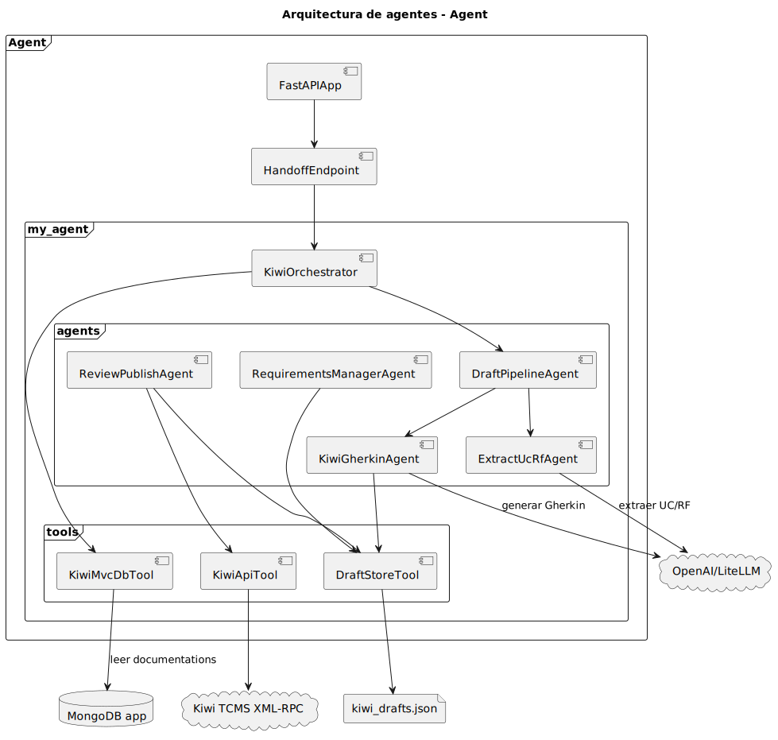

### Explicacion

`Agent_ApiKiwi` está construido como una aplicacion FastAPI integrada con Google ADK. Su punto de entrada principal para `kiwi-mvc` es:

`POST /api/kiwi-mvc/handoff`

Cuando recibe una sesion de `kiwi-mvc`, crea una sesion propia del runtime ADK y ejecuta el orquestador principal `kiwi_orchestrator`.

El orquestador puede invocar la herramienta `get_kiwimvc_session_docs`, que lee en modo solo lectura la coleccion `documentations` de MongoDB. A partir de ahí, delega el trabajo en agentes especializados:

- `draft_pipeline_agent`: coordina el flujo completo.
- `extract_uc_rf_agent`: extrae casos de uso y requisitos funcionales.
- `kiwi_gherkin_agent`: genera escenarios Gherkin y borradores.
- `review_publish_agent`: permite revisar, aceptar y publicar.
- `requirements_manager_agent`: gestiona UC y RF generados por los agentes.

Las herramientas proporcionan capacidades concretas:

- `kiwimvc_db.py`: lectura de documentacion desde MongoDB.
- `draft_store.py`: lectura/escritura del JSON de artefactos.
- `kiwi_api.py`: publicacion en Kiwi TCMS.

## 8. Bases de datos externas o no diseñadas por el sistema

En esta seccion se describen persistencias que aparecen en la arquitectura, pero que no forman parte de la base de datos diseñada en este trabajo. Las persistencias propias del sistema son `MongoDB` y el `JSON` de artefactos del subsistema automático en desarrollo.

### 8.1 MariaDB de Kiwi TCMS

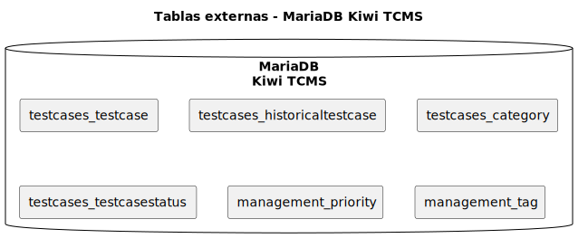

#### Explicacion

MariaDB pertenece a Kiwi TCMS. No es una base de datos creada ni gestionada por el sistema desarrollado.

`kiwi-mvc` y `Agent_ApiKiwi` no acceden directamente a estas tablas. La comunicacion se realiza mediante la API XML-RPC de Kiwi TCMS.

Por tanto, MariaDB no forma parte del modelo de datos diseñado en este trabajo. Es una persistencia interna de un sistema externo.

Tablas relevantes:

| Tabla | Uso |
| --- | --- |
| `testcases_testcase` | Casos de prueba publicados |
| `testcases_historicaltestcase` | Historial de cambios |
| `testcases_category` | Categorías disponibles |
| `testcases_testcasestatus` | Estados de los casos |
| `management_priority` | Prioridades |
| `management_tag` | Etiquetas gestionadas por Kiwi |

### 8.2 SQLite de Google ADK

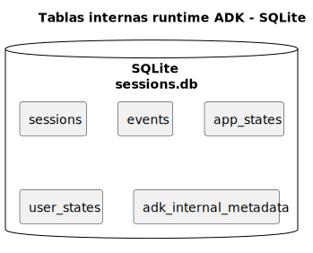

#### Explicacion

SQLite es utilizada internamente por Google ADK dentro de `Agent_ApiKiwi`.

No almacena datos funcionales del dominio. No contiene casos de uso, requisitos funcionales ni escenarios Gherkin del sistema principal. Su funcion es técnica: mantener sesiones, eventos y estado del runtime de agentes.

Por tanto, SQLite tampoco es una base de datos diseñada por este trabajo. Es una persistencia técnica del runtime ADK.

Tablas principales:

| Tabla | Uso |
| --- | --- |
| `sessions` | Sesiones internas del agente |
| `events` | Eventos de conversacion y ejecucion |
| `app_states` | Estado global de la aplicacion ADK |
| `user_states` | Estado por usuario |
| `adk_internal_metadata` | Metadatos internos |

## 9. Diagrama general del sistema

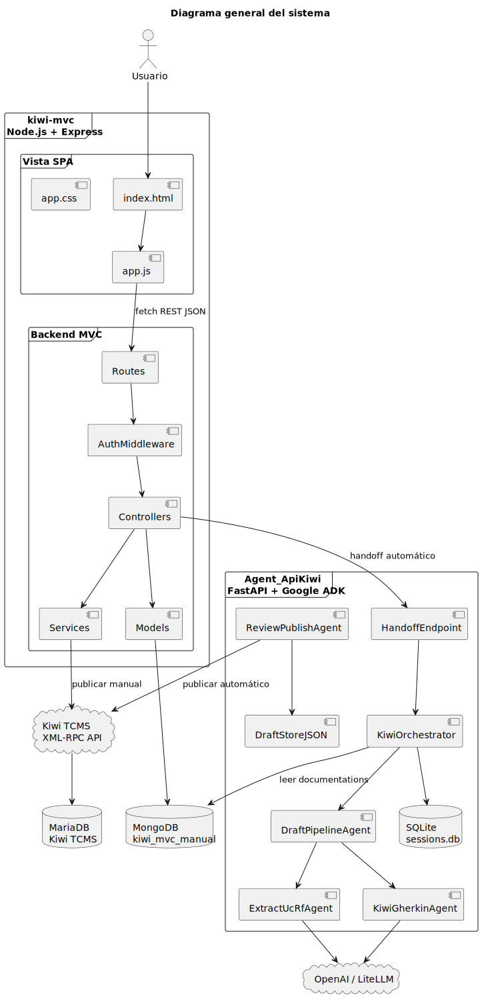

## 10. Conexion entre kiwi-mvc y Agent_ApiKiwi


### Explicacion

La conexion comienza en `kiwi-mvc` con la ruta:

`POST /api/sessions/:id/handoff-to-agent`

Esta ruta pertenece a `SessionController`. El controlador envía una peticion al endpoint del agente:

`POST /api/kiwi-mvc/handoff`

El body incluye:

```json
{
  "source_session_id": "ObjectId de la sesion de kiwi-mvc",
  "project_name": "nombre del proyecto",
  "session_name": "nombre de la sesion",
  "run_immediately": true
}
```

El agente crea una sesion ADK propia y devuelve datos como `agent_session_id`, `agent_user_id`, `agent_app_name` y `handoff_url`. Estos datos se guardan dentro del documento `Session` de MongoDB.

Después, el orquestador usa `get_kiwimvc_session_docs()` para leer unicamente la coleccion `documentations` de MongoDB.

## 11. Login en Kiwi y publicacion

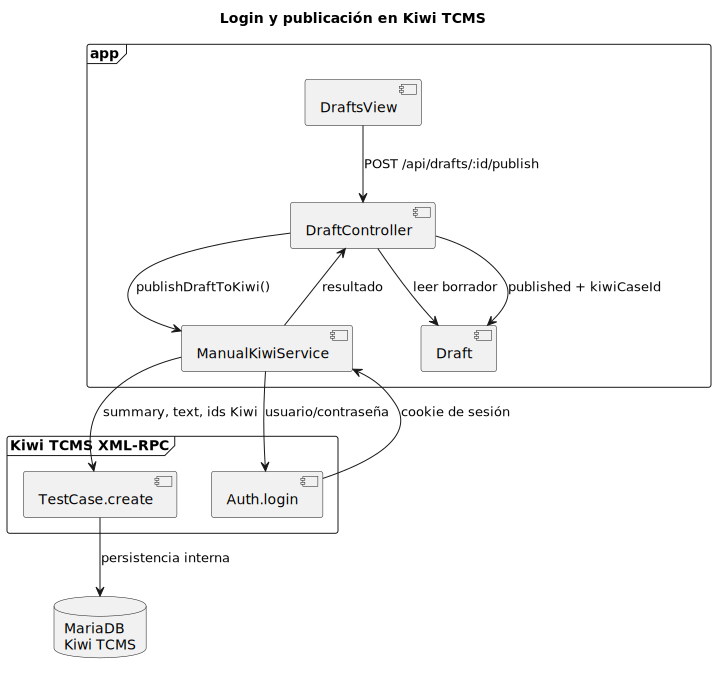

### Explicacion

La publicacion se realiza mediante `manualKiwiService`.

Primero se ejecuta:

`Auth.login(username, password)`

Kiwi devuelve una cookie de sesion. Esa cookie se reutiliza para ejecutar:

`TestCase.create(...)`

La creacion del caso incluye:

- `summary`
- `text/content`
- `product`
- `category`
- `priority`
- `case_status`
- `classification`
- `is_automated`

La aplicacion no escribe directamente en MariaDB. Kiwi TCMS recibe la peticion XML-RPC y persiste internamente el caso de prueba en su propia base de datos.

## 12. Tecnologías utilizadas

Antes de enumerar las tecnologías, conviene distinguir claramente las persistencias del sistema de las persistencias externas o técnicas:

- Persistencia propia del sistema desarrollado: `MongoDB` en `kiwi-mvc` y `JSON` de artefactos en `Agent_ApiKiwi` durante desarrollo.
- Persistencia externa o no diseñada por el sistema: `MariaDB` de Kiwi TCMS y `SQLite` interna de Google ADK.

### Backend kiwi-mvc

- `Node.js`: entorno de ejecucion del backend.
- `Express.js`: framework usado para crear la API REST.
- `MongoDB`: base de datos principal del sistema.
- `Mongoose`: ODM usado para definir esquemas y acceder a MongoDB.
- `express-session`: gestion de sesiones HTTP.
- `connect-mongo`: almacenamiento de sesiones HTTP en MongoDB.
- `bcryptjs`: hash y comparacion de contraseñas.

### Frontend

- `HTML`, `CSS` y `JavaScript`: usados para construir la SPA.
- `Fetch API`: comunicacion entre la vista y la API REST.
- `DOM dinámico`: renderizado de pantallas y formularios sin recarga completa.

### Subsistema automático

- `Python`: lenguaje del servicio de agentes.
- `FastAPI`: exposicion del endpoint de handoff y servidor del agente.
- `Google ADK`: runtime de agentes.
- `LiteLLM`: capa intermedia para invocar modelos LLM.
- `OpenAI`: proveedor de modelo configurado.
- `pymongo`: lectura de documentacion desde MongoDB.
- `SQLite`: persistencia técnica interna de ADK, no diseñada por el proyecto.
- `JSON`: almacenamiento local de artefactos generado por el sistema en desarrollo.
- `Docker`: ejecucion contenerizada del subsistema automático.

### Integracion externa

- `Kiwi TCMS`: sistema externo donde se publican los casos de prueba.
- `XML-RPC`: protocolo usado para autenticarse y crear casos en Kiwi.
- `MariaDB`: base de datos interna de Kiwi TCMS, externa al sistema y no gestionada por el proyecto.

## 13. Estructura de paquetes MVC


### Explicacion

La estructura de paquetes de `kiwi-mvc` sigue el patron MVC:

- Vista: formada por `public/index.html`, `public/css/app.css` y `public/js/app.js`.
- Controlador: formado por rutas, middleware y controladores Express.
- Modelo: formado por esquemas Mongoose.
- Servicios auxiliares: contienen logica reutilizable que no pertenece estrictamente al controlador ni al modelo.
- Configuracion: conexion a MongoDB y carga de variables de entorno compartidas.


